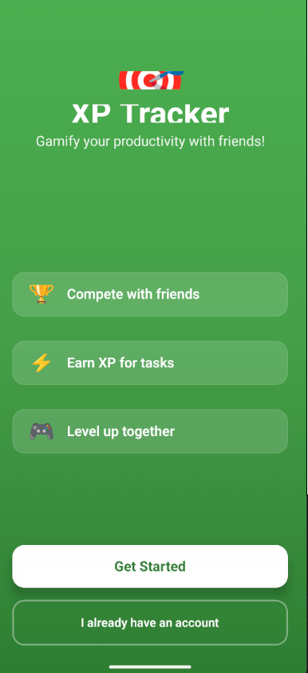
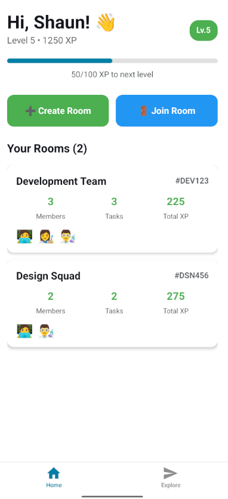
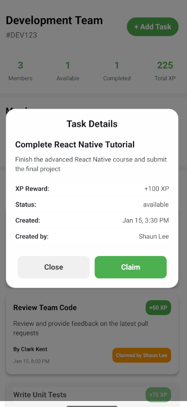
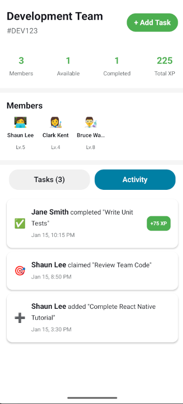

# 📱 XPLog - Task Management & Collaboration Platform

> **🚧 Work in Progress** - A React Native app for gamified task management and team collaboration

## 🎯 Overview

XPLog is a modern task management platform that combines productivity with gamification. Built with React Native and Expo, it enables teams to create collaborative rooms, manage tasks, and track progress through an XP-based reward system.

## ✨ Features

-   🏠 **Room-Based Collaboration** - Create and join rooms with unique codes
-   📋 **Task Management** - Create, claim, and complete tasks with XP rewards
-   🎮 **Gamification System** - XP rewards, user levels, and progress tracking
-   🎨 **Modern UI/UX** - Clean interface with dark/light theme support

## 📸 Screenshots

### Authentication Flow

  

### Home Dashboard

  

### Room Management

  

### Task Creation

  

### Activity Feed

  

## 🛠️ Tech Stack

-   **React Native** - Cross-platform mobile development
-   **Expo Router** - File-based navigation system
-   **TypeScript** - Type-safe development
-   **React Hooks** - Modern state management

## 🚀 Current Status

### ✅ Completed

-   [x] User authentication UI
-   [x] Room creation and joining
-   [x] Task management system
-   [x] XP and leveling system
-   [x] Activity logging and feeds
-   [x] Responsive design and theming

### 🔄 In Progress

-   [ ] Backend API integration
-   [ ] Real-time data synchronization
-   [ ] User authentication system
-   [ ] Data persistence

⚡ **Status**: Active development • Frontend complete • Backend integration in progress
