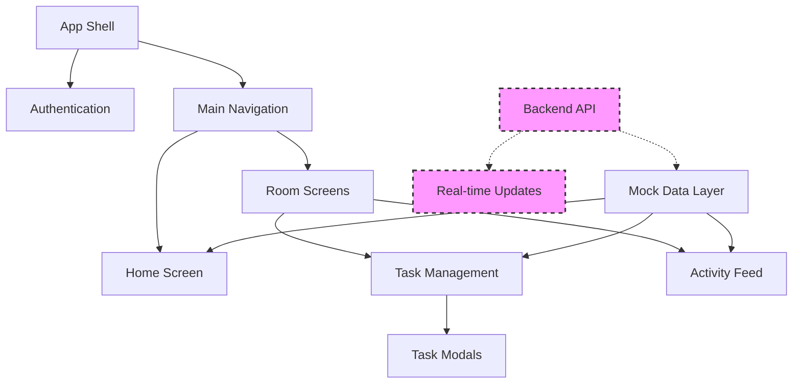

# 📱 XPLog - Task Management & Collaboration Platform

> **🚧 Work in Progress** - A React Native app for gamified task management and team collaboration

## 🎯 Overview

XPLog is a modern task management platform that combines productivity with gamification. Built with React Native and Expo, it enables teams to create collaborative rooms, manage tasks, and track progress through an XP-based reward system.

**Current Status**: Frontend development complete • Backend integration in progress

## ✨ Features

### 🏠 **Room-Based Collaboration**

-   Create and join rooms with unique codes
-   Real-time member management
-   Room-specific task boards and activity feeds

### 📋 **Task Management**

-   Create tasks with descriptions and XP rewards
-   Task claiming and completion system
-   Status tracking (Available → Claimed → Completed)

### 🎮 **Gamification System**

-   XP rewards for task completion
-   User levels and progress tracking
-   Activity logging and achievements

### 🎨 **Modern UI/UX**

-   Clean, intuitive interface
-   Dark/light theme support
-   Responsive design for all screen sizes
-   Smooth animations and transitions

## 📸 Screenshots

### Authentication Flow

<div align="center">
  
  <p><em>Login and Registration screens with modern UI</em></p>
</div>

### Home Dashboard

<div align="center">
  
  <p><em>Main dashboard with room navigation and user stats</em></p>
</div>

### Room Management

<div align="center">
  
  <p><em>Room dashboard with task overview, member list, and activity tabs</em></p>
</div>

### Task Creation

<div align="center">
  
  <p><em>Task creation modal with title, description, and XP reward fields</em></p>
</div>

### Activity Feed

<div align="center">
  
  <p><em>Real-time activity feed showing task updates and user actions</em></p>
</div>

## 🛠️ Tech Stack

### **Frontend**

-   **React Native** - Cross-platform mobile development
-   **Expo Router** - File-based navigation system
-   **TypeScript** - Type-safe development
-   **React Hooks** - Modern state management

### **Backend** (In Development)

-   **API Integration** - RESTful services
-   **Real-time Updates** - WebSocket connections
-   **User Authentication** - Secure login system
-   **Database** - Task and user data persistence

## 🏗️ Project Structure

```
xplog/
├── app/                    # Main app screens
│   ├── (tabs)/            # Tab navigation screens
│   ├── auth/              # Authentication screens
│   ├── room/              # Room management screens
│   └── _layout.tsx        # Root layout
├── components/            # Reusable UI components
├── constants/             # App constants and themes
├── data/                  # Mock data and types
├── hooks/                 # Custom React hooks
└── assets/               # Images and resources
```

## 🚀 Current Implementation

### ✅ **Completed Features**

-   [x] User authentication UI (Login/Register)
-   [x] Room creation and joining interface
-   [x] Task management system (CRUD operations)
-   [x] XP and leveling system
-   [x] Activity logging and feeds
-   [x] Responsive design and theming
-   [x] Navigation and routing

### 🔄 **In Progress**

-   [ ] Backend API integration
-   [ ] Real-time data synchronization
-   [ ] User authentication system
-   [ ] Push notifications
-   [ ] Data persistence

### 🎯 **Planned Features**

-   [ ] File attachments for tasks
-   [ ] Task categories and filters
-   [ ] Advanced user profiles
-   [ ] Team analytics and reporting
-   [ ] Mobile app deployment

## 💻 Development Setup

### Prerequisites

```bash
Node.js (v18 or higher)
npm or yarn
Expo CLI
```

### Installation

```bash
# Clone the repository
git clone https://github.com/yourusername/xplog.git
cd xplog

# Install dependencies
npm install

# Start the development server
npm start
```

### Running the App

```bash
# iOS Simulator
npm run ios

# Android Emulator
npm run android

# Web Browser
npm run web
```

## 🎨 Design Highlights

-   **Modern UI**: Clean, minimalist design with consistent spacing
-   **Responsive Layout**: Adapts to different screen sizes seamlessly
-   **Interactive Elements**: Smooth animations and haptic feedback
-   **Color Theming**: Support for light and dark modes
-   **Typography**: Consistent font hierarchy and readability

## 📊 App Architecture



## 🔮 Future Enhancements

-   **Team Analytics**: Performance metrics and productivity insights
-   **Advanced Gamification**: Badges, streaks, and achievements
-   **Integration**: Calendar sync and third-party tool connections
-   **Mobile Features**: Offline support and background notifications
-   **Scaling**: Multi-tenant architecture for enterprise use

## 👨‍💻 About the Developer

**Likhith Shankar Prithvi** - Backend Engineer @Wipro  
Currently exploring mobile development and building scalable solutions.

-   💼 **LinkedIn**: [/in/likhithprithvi](https://linkedin.com/in/likhithprithvi)
-   🌐 **Portfolio**: [shaunlee.in](https://shaunlee.in)
-   📧 **Email**: prithvi.likhith@gmail.com

---

⚡ **Status**: Active development • Frontend complete • Backend integration in progress


